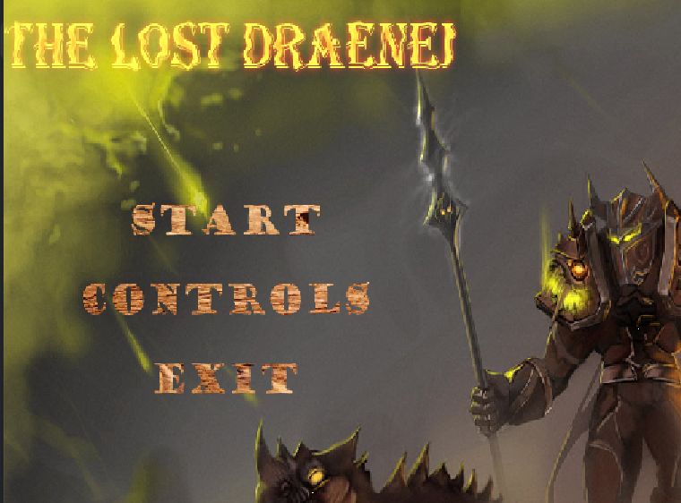
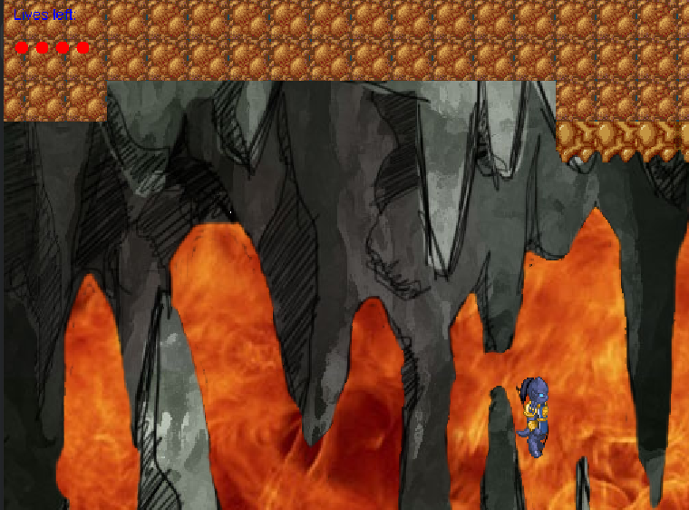

# The Lost Draenei

A 2D side-scrolling platformer in Java, written in 2014 as a university coursework project. Two
levels, each ending in a boss fight. The lore leans on World of Warcraft, and the game says so on
its own title card before the first level.

This repository is an archive of the project as it was. It is not maintained.





## Playing it

The game loads its images, sounds and maps by relative path, so run it from the repository root.

```
git clone https://github.com/AdrianNachev91/the-lost-draenei.git
cd the-lost-draenei
java -jar TheLostDraenei.jar
```

`TheLostDraenei.jar` was compiled in 2014 against Java 7 and still runs on a current JDK.

## Controls

| Action   | Key         |
| -------- | ----------- |
| Move     | Left, Right |
| Jump     | Up          |
| Shoot    | Space       |
| Back     | Escape      |

All four can be rebound from **Controls** on the main menu. Hover over the action, then press the
key you want.

You start with four lives, drawn as red dots in the top left corner.

## What is in it

Level 1 is a cave over lava, with zombies, spiders and worms, and a boss at the end. Level 2 goes
deeper, with dinosaurs, goblins and tigers, and a second boss that parries. The player fights with a
bow. Both levels are tile maps that scroll with the player.

```
src/          the game, and the game2D framework it is built on
maps/         tile maps, one folder per level
images/       backgrounds, menus, and one folder per character
animations/   frame lists, one text file per animation
sounds/       music and effects
```

## Building from source

There is no build file. Compile the sources anywhere, then run `Game` with the repository root as
the working directory so the asset paths resolve.

```
javac -d out $(find src -name '*.java')
java -cp out Game
```

## Credit

The `game2D` package is the teaching framework supplied with the course, not my work. Its author is
credited in the header of each of its files. Everything outside that package is mine.
